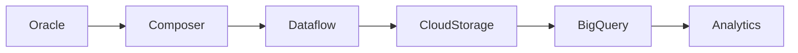

# Data Platform Architecture

## Objetivo

Procesar datos desde múltiples fuentes hacia una plataforma analítica en GCP.

---

## Flujo Principal

---

## Componentes

### Oracle
Fuente transaccional principal.

### Composer
Orquestación de pipelines y automatización.

### Dataflow
Procesamiento distribuido con Apache Beam.

### Cloud Storage
Landing y almacenamiento intermedio.

### BigQuery
Data warehouse analítico.