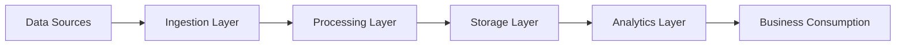
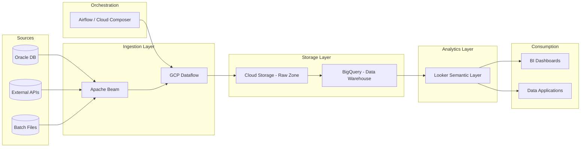

# Data Platform Architecture

AI-native data platform built on GCP principles for scalable ingestion, processing, storage, and analytics.

---

## 🧭 Architecture Overview (L0 - Business View)

## 🏗 L1 - Logical Architecture (Platform View)

