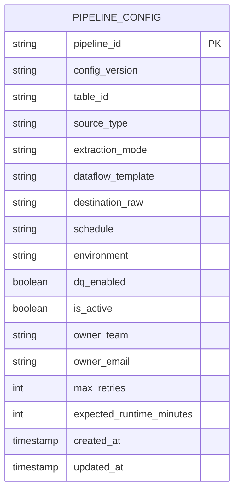
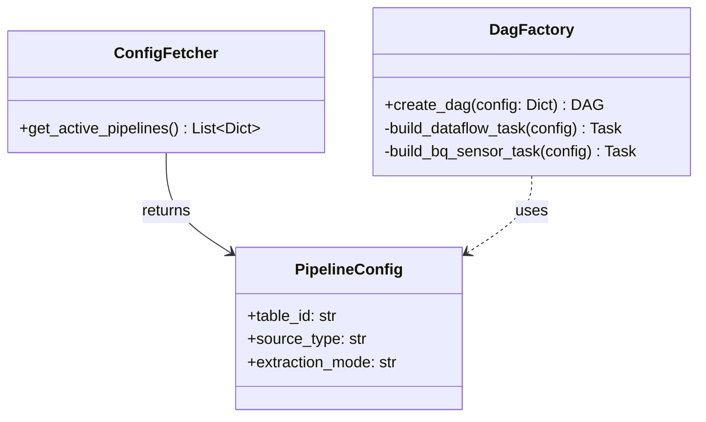
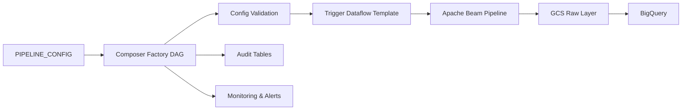

# Metadata-Driven Pipeline Orchestrator
Arquitectura de orquestación dinámica basada en metadatos para pipelines de datos sobre GCP.

## Objetivo
Centralizar y desacoplar la configuración de pipelines para permitir:

- escalabilidad operativa
- reducción de DAGs hardcodeados
- incorporación rápida de nuevas entidades
- reutilización de templates Dataflow
- estandarización de observabilidad y monitoreo

La plataforma utilizará una arquitectura metadata-driven donde Airflow actuará como plano de control (control plane) y Dataflow como plano de ejecución (execution plane).

## Arquitectura Conceptual

La plataforma se divide en dos capas principales:

| Layer | Responsabilidad |
|------|----------------|
| Control Plane | Orquestación, metadata, configuración y monitoreo |
| Execution Plane | Ejecución distribuida de pipelines y procesamiento de datos |

Airflow/Composer actuará como capa de control, mientras que Dataflow ejecutará los pipelines desacoplados de la lógica de orquestación.

## 1. Diseño de la Tabla de Configuración (BigQuery)
Para evitar hardcodear variables, Airflow leerá de una tabla de control.

## 2. Patrón de Diseño en Airflow (Factory)
En lugar de un script monolítico, usaremos el patrón Factory para instanciar los DAGs en base a la configuración leída.

## 3. Flujo Operacional

## 4. Estrategia de Escalabilidad

La plataforma busca minimizar la creación manual de DAGs y pipelines específicos.

Nuevas entidades podrán incorporarse mediante inserciones en la tabla `PIPELINE_CONFIG`, reutilizando templates y lógica compartida.

Beneficios:

- menor costo de mantenimiento
- onboarding más rápido
- comportamiento estandarizado
- observabilidad homogénea
- desacople entre configuración y ejecución

## 5. Estrategia de Observabilidad

La plataforma centralizará métricas operativas y logs para garantizar trazabilidad end-to-end.

Capacidades esperadas:

- monitoreo de jobs Dataflow
- tracking de DAGs en Composer
- auditoría de ejecuciones
- métricas de latencia
- alertas automáticas
- detección de fallos y retries

La observabilidad será considerada un componente nativo de la plataforma y no una capacidad agregada posteriormente.

## 6. Evolución Futura

Posibles extensiones:

- integración con Data Catalog
- soporte streaming (Pub/Sub)
- lineage automático
- data contracts
- policy-based orchestration
- integración con Terraform
- self-service onboarding de pipelines

