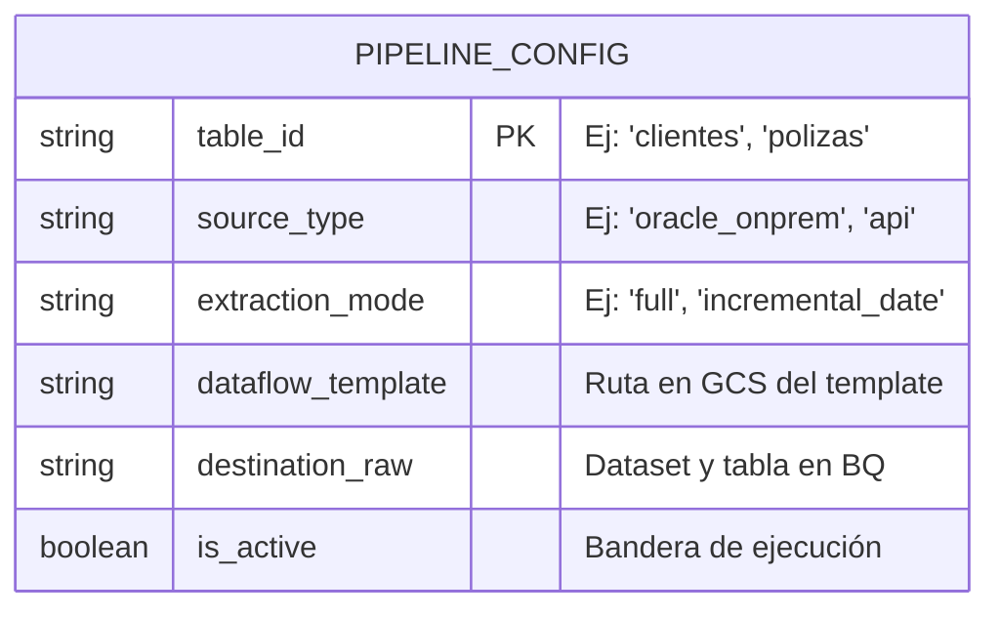
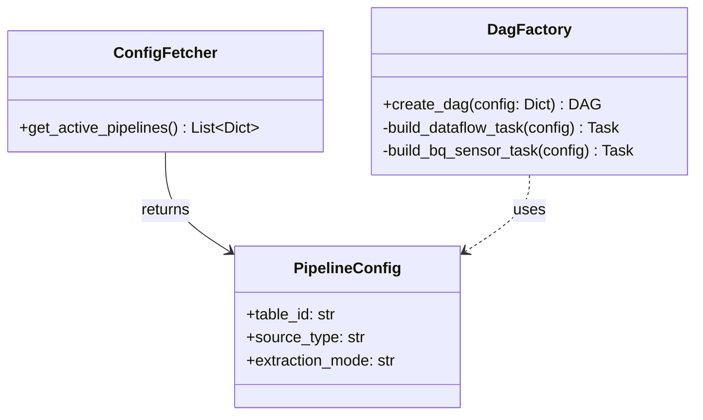

# Orquestador Dinámico por Metadatos

## 1. Diseño de la Tabla de Configuración (BigQuery)
Para evitar hardcodear variables, Airflow leerá de una tabla de control.

## 2. Patrón de Diseño en Airflow (Factory)
En lugar de un script monolítico, usaremos el patrón Factory para instanciar los DAGs en base a la configuración leída.

