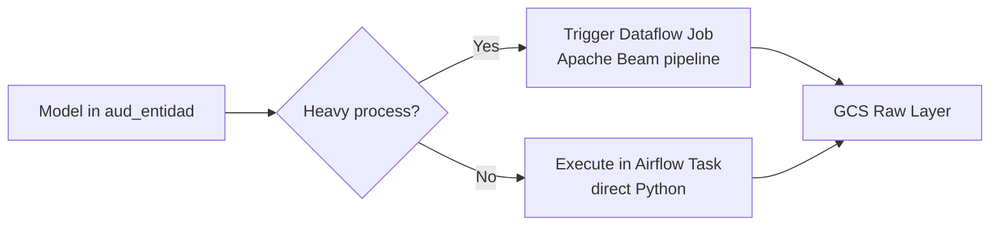

# Platform Architecture

---

## L1 — Logical Architecture

The platform follows a layered data architecture separating ingestion, processing, storage, and consumption concerns.

```mermaid
flowchart TD
    subgraph Ingestion Layer
        I1[JDBC Extract\nOracle]
        I2[File Ingestion\nCSV / Avro]
        I3[API Ingestion\nREST]
        I4[PDF Parser\ntabular data]
    end

    subgraph Orchestration Layer
        O1[Chain DAGs\nper source]
        O2[Group DAGs\nper model group]
        O3[Audit Framework\nmetadata-driven]
    end

    subgraph Processing Layer
        P1[Airflow Tasks\nlight processing]
        P2[Dataflow Jobs\nheavy processing]
    end

    subgraph Storage Layer
        S1[Raw Layer\nGCS Avro]
        S2[History Layer\nBQ partitioned]
        S3[Active Layer\nBQ MERGE/UPSERT]
    end

    subgraph Consumption Layer
        C1[Looker\nSemantic Layer]
        C2[Dashboards]
        C3[Applications]
    end

    Ingestion Layer --> Orchestration Layer
    Orchestration Layer --> Processing Layer
    Processing Layer --> Storage Layer
    Storage Layer --> Consumption Layer
```

---

## L2 — Physical Implementation (GCP)

### Ingestion

| Source | Method | Executor |
|--------|--------|----------|
| Oracle DB | JDBC via Beam | Dataflow (heavy) or Airflow task (light) |
| CSV / Files | Direct read | Airflow task |
| REST APIs | HTTP client | Airflow task |
| PDFs | Custom PDF parser | Airflow task |

All ingestion outputs land in **Cloud Storage as Avro files**, partitioned by date.

### Processing Decision



The decision of whether to use Dataflow or execute directly in Airflow is driven by the metadata in `aud_entidad`.

### Storage

| Layer | Technology | Format | Partitioning |
|-------|-----------|--------|-------------|
| Raw | Cloud Storage | Avro | `fecha_lote` (date folder) |
| History | BigQuery native table | Columnar | `fecha_lote` partition |
| Active | BigQuery native table | Columnar | None (latest version per PK) |

### Orchestration

- **Cloud Composer 2** running Airflow 2.x
- DAGs read configuration from `aud_*` tables in BigQuery at runtime
- Framework libraries imported by DAGs as Python modules

### Security & Operations

- IAM roles per service account (Composer, Dataflow, BQ, GCS)
- Cloud KMS for encryption at rest
- Cloud Logging for centralized log aggregation
- GitHub Actions for CI/CD of DAGs and pipeline code
