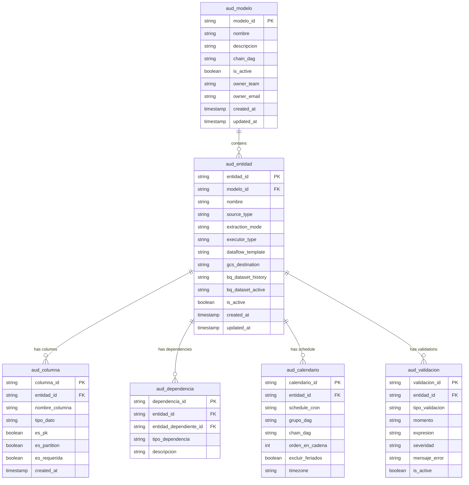

# Audit Tables (aud_*)

The `aud_*` tables are the configuration backbone of the platform.
They live in BigQuery and define every aspect of pipeline behavior at runtime.

---

## Table Hierarchy



---

## Table Reference

### aud_modelo

Top-level grouping. Represents a business domain or data model.

| Column | Type | Description |
|--------|------|-------------|
| `modelo_id` | STRING | Unique identifier, used as DAG lookup key |
| `nombre` | STRING | Human-readable name |
| `descripcion` | STRING | Business context |
| `chain_dag` | STRING | Which chain DAG owns this model |
| `is_active` | BOOL | Whether this model is processed |
| `owner_team` | STRING | Responsible team |
| `owner_email` | STRING | Contact for alerts |

---

### aud_entidad

One row per table/entity extracted from a source.

| Column | Type | Description |
|--------|------|-------------|
| `entidad_id` | STRING | Unique identifier |
| `modelo_id` | STRING | FK to aud_modelo |
| `nombre` | STRING | Entity name (maps to table/file name) |
| `source_type` | STRING | `oracle` / `api_rest` / `csv` / `pdf` |
| `extraction_mode` | STRING | `full` / `incremental` |
| `executor_type` | STRING | `airflow` / `dataflow` |
| `dataflow_template` | STRING | Template name if executor = dataflow |
| `gcs_destination` | STRING | GCS bucket/path for raw Avro |
| `bq_dataset_history` | STRING | BQ dataset for history table |
| `bq_dataset_active` | STRING | BQ dataset for active table |
| `is_active` | BOOL | Whether this entity is processed |

**Valid values:**

```yaml
source_type: [oracle, api_rest, csv, pdf]
extraction_mode: [full, incremental]
executor_type: [airflow, dataflow]
```

---

### aud_columna

Schema definition per entity. Drives MERGE keys and validations.

| Column | Type | Description |
|--------|------|-------------|
| `columna_id` | STRING | Unique identifier |
| `entidad_id` | STRING | FK to aud_entidad |
| `nombre_columna` | STRING | Column name in source and BQ |
| `tipo_dato` | STRING | BQ data type |
| `es_pk` | BOOL | Used as MERGE key in active layer |
| `es_partition` | BOOL | Partition column (fecha_lote) |
| `es_requerida` | BOOL | NOT NULL validation |

---

### aud_dependencia

Defines execution dependencies between entities.

| Column | Type | Description |
|--------|------|-------------|
| `dependencia_id` | STRING | Unique identifier |
| `entidad_id` | STRING | Entity that depends on another |
| `entidad_dependiente_id` | STRING | Entity that must complete first |
| `tipo_dependencia` | STRING | `data` / `execution` |
| `descripcion` | STRING | Reason for dependency |

---

### aud_calendario

Controls scheduling and chain placement.

| Column | Type | Description |
|--------|------|-------------|
| `calendario_id` | STRING | Unique identifier |
| `entidad_id` | STRING | FK to aud_entidad |
| `schedule_cron` | STRING | Cron expression |
| `grupo_dag` | STRING | Which Group DAG this entity belongs to |
| `chain_dag` | STRING | Which Chain DAG owns this group |
| `orden_en_cadena` | INT | Sequential order within the chain |
| `excluir_feriados` | BOOL | Skip execution on holidays |
| `timezone` | STRING | e.g. `America/Argentina/Buenos_Aires` |

---

### aud_validacion

Validation rules evaluated pre and post extraction.

| Column | Type | Description |
|--------|------|-------------|
| `validacion_id` | STRING | Unique identifier |
| `entidad_id` | STRING | FK to aud_entidad |
| `tipo_validacion` | STRING | `row_count` / `schema` / `not_null` / `business_rule` |
| `momento` | STRING | `pre_extraction` / `post_extraction` / `post_load` |
| `expresion` | STRING | SQL expression or threshold |
| `severidad` | STRING | `warning` / `error` (error halts pipeline) |
| `mensaje_error` | STRING | Human-readable error description |
| `is_active` | BOOL | Whether this rule is evaluated |

---

## How the Framework Reads These Tables

At DAG startup, the framework executes a single parameterized query:

```sql
SELECT
    e.*,
    ARRAY_AGG(c) AS columnas,
    ARRAY_AGG(v) AS validaciones,
    cal.grupo_dag,
    cal.orden_en_cadena
FROM aud_entidad e
JOIN aud_modelo m ON e.modelo_id = m.modelo_id
JOIN aud_calendario cal ON e.entidad_id = cal.entidad_id
LEFT JOIN aud_columna c ON e.entidad_id = c.entidad_id
LEFT JOIN aud_validacion v ON e.entidad_id = v.entidad_id AND v.is_active = TRUE
WHERE cal.grupo_dag = @dag_name
  AND e.is_active = TRUE
  AND m.is_active = TRUE
GROUP BY e.entidad_id, ..., cal.grupo_dag, cal.orden_en_cadena
```

The result is a fully resolved config object per entity, ready for task generation.
