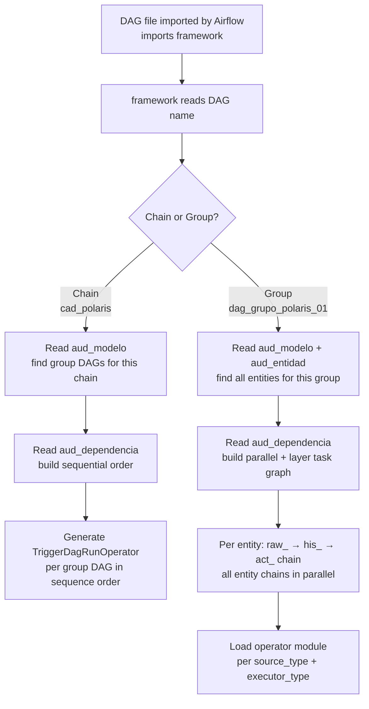
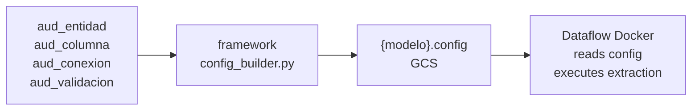
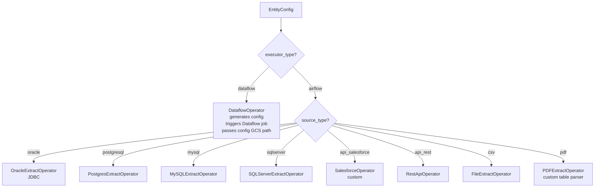
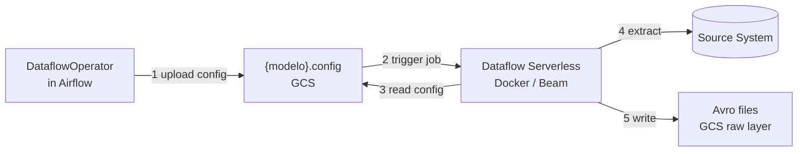
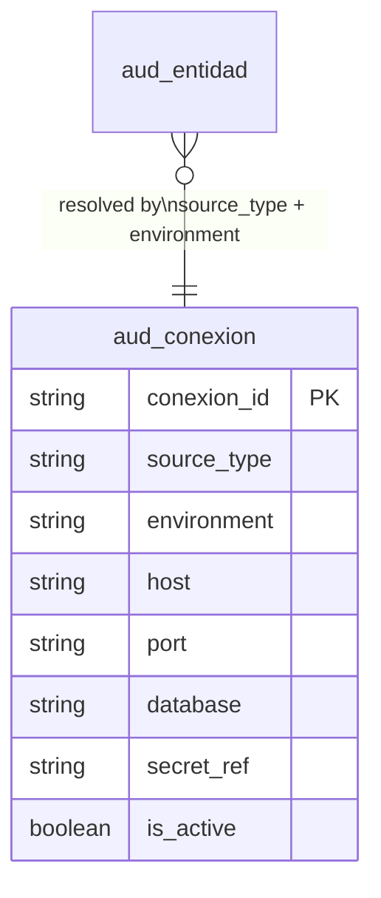

# Orchestration Framework

The platform uses a custom metadata-driven orchestration framework built on top of Airflow.
DAGs contain no hardcoded logic — the `framework` module reads `aud_*` tables at runtime
and dynamically builds the full execution graph.

---

## Core Design Principles

- **Metadata-driven:** all pipeline behavior defined in `aud_*` tables, not in code
- **Serialized by chain:** source extractions run sequentially per chain to protect source DBs
- **Parallelized by group:** models within a group run concurrently
- **Decoupled control/execution:** Airflow is the control plane, Dataflow is the execution plane
- **Config-driven Dataflow:** a `{modelo}.config` file in GCS is the contract between both planes

---

## DAG Hierarchy

```mermaid
flowchart TD
    subgraph Chain DAG
        CAD[cad_polaris]
    end

    subgraph Group DAG A — orden 1
        GA[dag_grupo_polaris_01]
        M1[raw_tabla_1] --> H1[his_tabla_1] --> A1[act_tabla_1]
        M2[raw_tabla_2] --> H2[his_tabla_2] --> A2[act_tabla_2]
    end

    subgraph Group DAG B — orden 2
        GB[dag_grupo_polaris_02]
        M3[raw_tabla_3] --> H3[his_tabla_3] --> A3[act_tabla_3]
    end

    CAD -->|triggers — waits for completion| GA
    GA -->|completes then triggers| GB
```

**Chain DAG** (`cad_{source}`)
- One per source system (e.g. `cad_polaris`, `cad_salesforce`)
- Reads `aud_modelo` to discover all group DAGs for this chain
- Triggers group DAGs **sequentially**, order defined by `aud_dependencia`
- Protects source systems from concurrent load

**Group DAG** (`dag_grupo_{source}_{nn}`)
- One per logical model group within a chain
- Contains N models, each following `raw_ → his_ → act_` sequence
- Models run **in parallel** across the group
- Within each model, layers are **serialized**: raw → his → act

---

## Framework Module — How It Works

Every DAG imports the `framework` module. This module reads the DAG name, determines
whether it is a chain or group, and builds the entire task graph dynamically.



---

## Config File — `{modelo}.config`

Before executing any extraction, the framework resolves all metadata and generates
a self-contained config file, uploaded to GCS.

This is the **contract between the control plane (Airflow) and execution plane (Dataflow)**.
Dataflow reads this file and needs no further access to `aud_*` tables.



**Structure of `{modelo}.config`:**

```json
{
  "modelo": "poliza_detalle",
  "fecha_lote": "2024-01-15",
  "source": {
    "type": "oracle",
    "connection": { "secret_ref": "projects/.../secrets/oracle-polaris-prd" },
    "query": "SELECT NRO_POLIZA, FECHA_INICIO ... WHERE FECHA_MOD >= :watermark",
    "extraction_mode": "incremental"
  },
  "avro_schema": {
    "type": "record",
    "name": "poliza_detalle",
    "fields": [
      { "name": "NRO_POLIZA", "type": "string" },
      { "name": "FECHA_INICIO", "type": { "type": "int", "logicalType": "date" } }
    ]
  },
  "destination": {
    "gcs_path": "gs://prd-platform-raw/polizas/poliza_detalle/fecha_lote=2024-01-15/",
    "format": "avro"
  },
  "validations": [
    { "type": "row_count", "threshold": 0, "severity": "error" },
    { "type": "not_null", "column": "NRO_POLIZA", "severity": "error" }
  ]
}
```

**How the config is built from `aud_*`:**

| Config field | Source table | Field |
|---|---|---|
| `source.type` | `aud_entidad` | `source_type` |
| `source.query` | Built from `aud_columna` | columns where `incluir_extraccion = TRUE` |
| `source.connection` | `aud_conexion` | resolved by `source_type + environment` |
| `avro_schema.fields` | `aud_columna` | `nombre_columna + tipo_dato` per entity |
| `destination.gcs_path` | `aud_entidad` | `gcs_destination + fecha_lote` |
| `validations` | `aud_validacion` | all active rules for this entity |

---

## Operator Selection

The framework dynamically loads the correct operator based on `source_type` and `executor_type`:



All operators share the same interface:
```python
def execute(entity: EntityConfig, fecha_lote: date) -> ExtractResult: ...
```

---

## Dataflow Execution

When `executor_type = dataflow`, the framework triggers a serverless Dataflow FlexTemplate
running a Docker image with the Beam pipeline code.



The Docker image is **source-agnostic** — it supports all source types.
The config file tells it which extractor to use and how to configure it.

---

## Full Execution Flow per Model

```mermaid
flowchart TD
    GRP[Group DAG triggered]
    --> CFG_B[Build {modelo}.config\nfrom all aud_* tables]
    --> CFG_U[Upload config to GCS]
    --> PRE[Pre-validations\naud_validacion momento=pre_extraction]
    --> EXEC{executor_type?}

    EXEC -- airflow --> EXA[Run operator directly\nin Airflow worker]
    EXEC -- dataflow --> EXD[Trigger Dataflow job\nwait for completion]

    EXA --> RAW[Avro written to GCS\nfecha_lote partition]
    EXD --> RAW

    RAW --> POST[Post-validations\nrow_count + schema]
    POST --> HIS[raw_ task completes\nhis_ task starts\nINSERT INTO history BQ]
    HIS --> ACT[his_ task completes\nact_ task starts\nMERGE into active by PK]
    ACT --> AUDIT[Write to aud_ejecucion\nestado + stats]
```

---

## Connections — `aud_conexion`

Connection details are stored in `aud_conexion`, not hardcoded in DAGs or Airflow connections.
Credentials are resolved at runtime via GCP Secret Manager.



This enables:
- Environment-specific connections (dev / stg / prd) using the same DAG code
- Credential rotation without code or DAG changes
- Multiple connections per source type

---

## Naming Conventions

| Artifact | Pattern | Example |
|---------|---------|---------|
| Chain DAG | `cad_{source}` | `cad_polaris` |
| Group DAG | `dag_grupo_{source}_{nn}` | `dag_grupo_polaris_01` |
| Config file (GCS) | `gs://.../configs/{modelo}_{fecha_lote}.config` | `poliza_detalle_2024-01-15.config` |
| Dataflow job | `{modelo}-{fecha_lote}` | `poliza-detalle-2024-01-15` |
| Raw task | `raw_{entidad}` | `raw_poliza_detalle` |
| History task | `his_{entidad}` | `his_poliza_detalle` |
| Active task | `act_{entidad}` | `act_poliza_detalle` |
