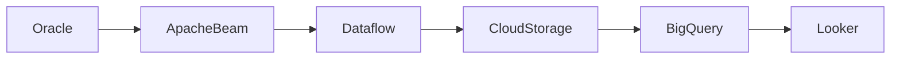

# Data Platform Lab

Laboratorio personal orientado a:

- Data Engineering
- Platform Engineering
- AI Native Development
- CI/CD
- Docker
- Kubernetes
- Documentation as Code

---

# Objetivos

- Aprender arquitectura moderna
- Automatizar workflows
- Crear documentación viva
- Diseñar plataformas reproducibles
- Integrar IA al desarrollo

---

# Arquitectura Actual

