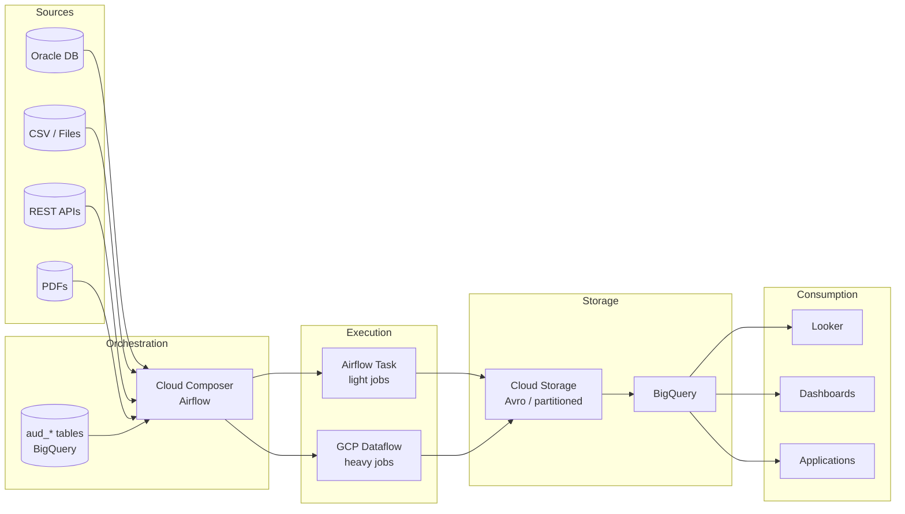

# Insurance Data Platform

Data Engineering platform for an insurance company built on GCP.
Handles multi-source ingestion, transformation, and serving of insurance data assets.

---

## Platform Summary

| Aspect | Detail |
|--------|--------|
| Cloud | Google Cloud Platform |
| Orchestration | Cloud Composer (Airflow 2.x) |
| Processing | Apache Beam / GCP Dataflow |
| Storage | Cloud Storage (Avro) + BigQuery |
| Sources | Oracle DB, CSV files, REST APIs, PDFs |
| Pattern | Metadata-driven, chain-based orchestration |

---

## Documentation Structure

- [Platform Architecture](./architecture/overview.md) — L1 logical + L2 physical view
- [Data Layers](./layers/overview.md) — Raw, History, Active pattern
- [Orchestration Framework](./framework/overview.md) — Chain/Group DAG pattern
- [Audit Tables](./framework/audit-tables.md) — `aud_*` metadata model
- [Operations](./operations/runbook.md) — Day-to-day operations

---

## High-Level Flow

