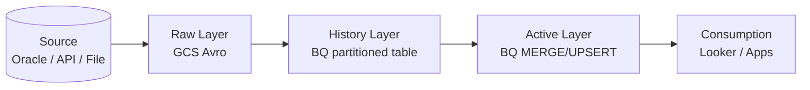
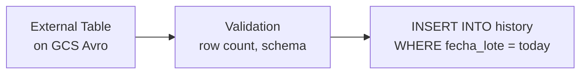
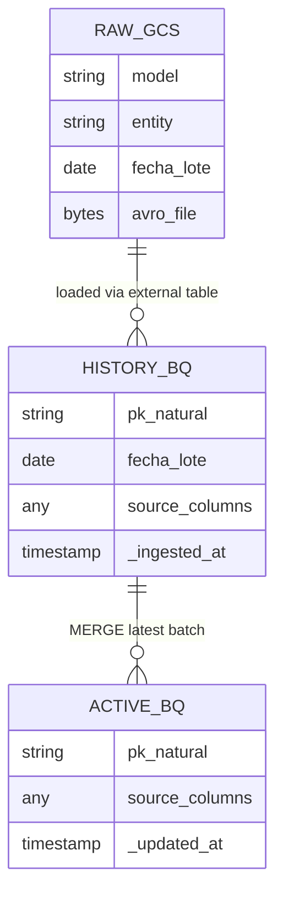

# Data Layers

Every data model in the platform follows a three-layer pattern: **Raw → History → Active**.

---

## Overview



---

## Raw Layer

**Location:** Cloud Storage
**Format:** Avro
**Partitioning:** Date-based folder structure

```
gs://{env}-{project}-raw/
└── {model}/
    └── {entity}/
        └── fecha_lote={YYYY-MM-DD}/
            └── {entity}_{timestamp}.avro
```

**Purpose:**
- Landing zone for every extraction
- Immutable — never modified after write
- Source of truth for reprocessing
- Enables point-in-time recovery of any batch

**Schema enforcement:** Avro schema defined per entity, validated at write time.

---

## History Layer

**Location:** BigQuery
**Table type:** Native partitioned table
**Partition column:** `fecha_lote` (DATE)

```sql
-- Example structure
CREATE TABLE `{project}.{dataset}.{entity}_history`
PARTITION BY fecha_lote
OPTIONS (partition_expiration_days = null)
AS SELECT
  -- all source columns
  ...,
  fecha_lote DATE,
  _ingested_at TIMESTAMP
FROM EXTERNAL TABLE on GCS Avro
```

**Purpose:**
- Full historical record of every extraction batch
- Each `fecha_lote` partition = one complete daily batch
- Never updated — append only (one partition per batch)
- Enables time-travel queries: _"what did we know on date X?"_

**Loading pattern:**



---

## Active Layer

**Location:** BigQuery
**Table type:** Native table (no partitioning)
**Key:** Natural PK of the entity (defined in `aud_columna`)

**Purpose:**
- Latest known version of each record
- Primary consumption layer for Looker, dashboards, applications
- Always reflects the most recent extraction

**Build strategy — MERGE/UPSERT:**

The platform migrated from truncate-and-reload to incremental MERGE for cost optimization.

```sql
MERGE `{project}.{dataset}.{entity}_active` AS target
USING (
    SELECT *
    FROM `{project}.{dataset}.{entity}_history`
    WHERE fecha_lote = @fecha_lote
) AS source
ON target.{pk_column} = source.{pk_column}
WHEN MATCHED THEN
    UPDATE SET
        -- all non-pk columns
        target._updated_at = CURRENT_TIMESTAMP()
WHEN NOT MATCHED THEN
    INSERT ROW
```

The PK columns used in the MERGE are sourced from `aud_columna` at runtime.

**Evolution of active layer strategy:**

| Phase | Strategy | Reason for change |
|-------|---------|------------------|
| Initial | Truncate + full reload | Simple, reliable |
| Current | MERGE / UPSERT | Cost reduction — avoid full table rewrites |

---

## Layer Relationships



---

## Naming Conventions

| Layer | GCS Path / BQ Dataset | Table Name |
|-------|----------------------|------------|
| Raw | `gs://{env}-{project}-raw/{model}/{entity}/` | N/A (files) |
| History | `{model}_history` dataset | `{entity}_history` |
| Active | `{model}_active` dataset | `{entity}_active` |
