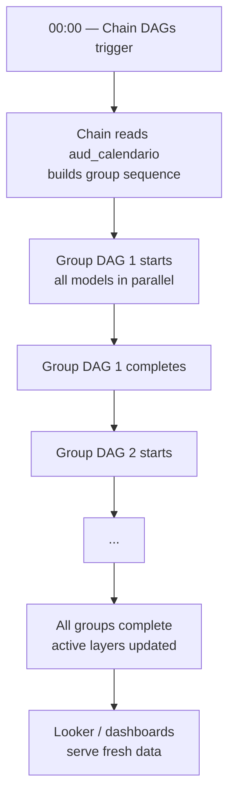

# Operations Runbook

Day-to-day operations guide for the Insurance Data Platform.

---

## Daily Execution Flow



---

## Adding a New Entity

To onboard a new table or data source, no code changes are needed.
Insert rows into the audit tables:

```sql
-- 1. Ensure model exists (or insert)
INSERT INTO aud_modelo (modelo_id, nombre, chain_dag, is_active, owner_team)
VALUES ('polizas', 'Pólizas', 'chain__oracle_polizas', TRUE, 'data-engineering');

-- 2. Register the entity
INSERT INTO aud_entidad (
    entidad_id, modelo_id, nombre,
    source_type, extraction_mode, executor_type,
    gcs_destination, bq_dataset_history, bq_dataset_active,
    is_active
) VALUES (
    'poliza_detalle', 'polizas', 'POLIZA_DETALLE',
    'oracle', 'incremental', 'dataflow',
    'gs://prd-platform-raw/polizas/poliza_detalle/',
    'polizas_history', 'polizas_active',
    TRUE
);

-- 3. Define PK and columns
INSERT INTO aud_columna (columna_id, entidad_id, nombre_columna, tipo_dato, es_pk)
VALUES
    ('pd_nro_poliza', 'poliza_detalle', 'NRO_POLIZA', 'STRING', TRUE),
    ('pd_fecha_inicio', 'poliza_detalle', 'FECHA_INICIO', 'DATE', FALSE);

-- 4. Assign to a group and chain
INSERT INTO aud_calendario (entidad_id, grupo_dag, chain_dag, orden_en_cadena, schedule_cron)
VALUES ('poliza_detalle', 'group__oracle_polizas__core', 'chain__oracle_polizas', 1, '0 1 * * *');

-- 5. Add validations
INSERT INTO aud_validacion (entidad_id, tipo_validacion, momento, expresion, severidad)
VALUES
    ('poliza_detalle', 'row_count', 'post_extraction', 'count > 0', 'error'),
    ('poliza_detalle', 'not_null', 'post_load', 'NRO_POLIZA IS NOT NULL', 'error');
```

---

## Common Failure Scenarios

### Oracle extraction failed

**Symptoms:** Chain DAG fails at Group 1, downstream groups don't run.

**Check:**
1. Airflow logs for the failed task
2. Oracle DB connectivity from Composer network
3. `aud_validacion` — pre-extraction validation may have blocked execution
4. Check if `extraction_mode = incremental` — watermark table may be stale

**Resolution:**
```sql
-- Check last successful run
SELECT * FROM aud_ejecucion
WHERE entidad_id = '{entity}'
ORDER BY fecha_ejecucion DESC
LIMIT 10;
```

---

### History table missing rows

**Symptoms:** History partition for `fecha_lote = today` is empty or missing.

**Check:**
1. GCS — does the Avro file exist for today's date?
2. External table — is it pointing to the correct GCS path?
3. BQ load job — did the INSERT INTO history complete?

**Resolution:** Re-trigger the Group DAG for the affected models. Airflow's backfill mechanism handles re-runs safely because history inserts are partitioned by `fecha_lote`.

---

### Active layer out of sync

**Symptoms:** Active table doesn't reflect today's data.

**Check:**
1. Did the History load complete first?
2. MERGE job — check BQ job history for errors
3. PK definition — confirm `es_pk = TRUE` columns in `aud_columna` are correct

---

### Dataflow job not triggering

**Symptoms:** `executor_type = dataflow` entity stays pending.

**Check:**
1. `dataflow_template` value in `aud_entidad` — must match a deployed template name
2. Dataflow API quotas in GCP project
3. Service account permissions for Composer → Dataflow

---

## Reprocessing a Batch

To reprocess a specific `fecha_lote`:

```sql
-- 1. Delete existing history partition
DELETE FROM `{project}.{dataset}.{entity}_history`
WHERE fecha_lote = '{fecha_lote}';

-- 2. Re-trigger the DAG via Airflow UI or CLI
# airflow dags trigger group__{source}__{group} --conf '{"fecha_lote": "2024-01-15"}'
```

The active layer will be rebuilt automatically via MERGE after history is reloaded.

---

## Monitoring Checklist

| Check | How | Frequency |
|-------|-----|-----------|
| All Chain DAGs completed | Airflow UI — Tree view | Daily |
| History partitions present | BQ — `SELECT COUNT(*) ... WHERE fecha_lote = today` | Daily |
| Active layer row count stable | BQ — compare today vs yesterday | Daily |
| Dataflow job durations | GCP Console — Dataflow jobs | Daily |
| Validation failures | `aud_ejecucion` table — `estado = ERROR` | Daily |
| GCS storage growth | GCP Console — Storage metrics | Weekly |
